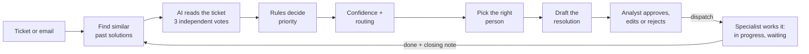

# Triage Copilot

**An AI assistant for service-desk analysts.** Built for the Swiss Life challenge at Swiss {ai} Weeks, Zurich 2026.

A Jira ticket arrives. Triage Copilot works out what it really is (incident or request), which
service and team own it, how urgent it is, who should handle it and how it will probably be
resolved. It shows its reasoning step by step. The department's **Team Lead / Analyst** approves,
edits or rejects every proposal, which dispatches the ticket to a **specialist**. The specialist
works it and marks it **done**, and only then does the fix become knowledge for the next ticket.



---

## Quick start (local, about 5 minutes)

**You need:** Docker Desktop (running), `git`, `make`, and ideally an OpenAI API key.

```bash
git clone https://github.com/Shivamm08/Swiss_AI_Zurich_Hackathon26.git
cd Swiss_AI_Zurich_Hackathon26

cp .env.example .env          # then open .env and paste your OPENAI_API_KEY
# put the challenge file into data/raw/ (see data/README.md)

make up-local                 # start everything with a local database (keep this terminal open)
```

In a **second terminal**, once the logs show `Application startup complete`:

```bash
make import-challenge         # load the 20 challenge tickets (once)
make seed-demo                # optional: a clearly labelled, simulated 4-week history for demos
```

Open **http://localhost:5173**. Click **▶ Triage** on any ticket to watch the AI work through it live,
press **⌘K / Ctrl+K** to ask the Copilot, and use the persona button (top right) to see the app as a
Team Lead / Analyst, a specialist or the admin.

| Address | What |
|---|---|
| http://localhost:5173 | The app |
| http://localhost:8000/docs | API documentation (try every endpoint) |

No OpenAI key? The app still runs in **heuristic mode**: it keeps the intake values and marks
everything low-confidence. Stop the app with `Ctrl+C` or `make down`.

---

## Documentation

The full guide is in the **[project wiki](docs/wiki/Home.md)**:

| Page | Read it when you want to… |
|---|---|
| [What and why](docs/wiki/01-What-and-Why.md) | understand the challenge, the product and the key terms |
| [Setup and running](docs/wiki/02-Setup-and-Running.md) | install, run, switch databases, fix common problems |
| [Architecture](docs/wiki/03-Architecture.md) | see how the pieces fit together |
| [Triage pipeline](docs/wiki/04-Triage-Pipeline.md) | follow one ticket through every step |
| [Priority and confidence](docs/wiki/05-Priority-and-Confidence.md) | know exactly how priority, confidence and routing are decided |
| [Assignment and workload](docs/wiki/06-Assignment-and-Workload.md) | know who gets a ticket and why |
| [Knowledge base and RAG](docs/wiki/07-Knowledge-Base-and-RAG.md) | understand retrieval and the learning loop |
| [Data and database](docs/wiki/08-Data-and-Database.md) | learn the dataset facts, tables and migrations |
| [API reference](docs/wiki/09-API-Reference.md) | call the backend |
| [Frontend guide](docs/wiki/10-Frontend-Guide.md) | work on the UI |
| [Configuration](docs/wiki/11-Configuration.md) | change settings in `.env` |
| [Development workflow](docs/wiki/12-Development-Workflow.md) | contribute without breaking things |
| [Collaboration and Copilot](docs/wiki/13-Collaboration-and-Copilot.md) | use the Copilot, messages, escalations and personas |
| [Impact and demo data](docs/wiki/14-Impact-and-Demo-Data.md) | see the pain points we solve and how the demo history is made |
| [Roles and ticket lifecycle](docs/wiki/15-Roles-and-Ticket-Lifecycle.md) | know who does what, from arrival to done |

---

## What's inside

- **Live triage walkthrough:** watch retrieval, 3 AI votes, the priority rules, confidence and assignment happen step by step.
- **Three clear roles:** the Team Lead / Analyst checks every AI proposal and dispatches it, the Specialist does the work and closes it, the Admin runs the system. Low-confidence tickets go to a shared Needs-review queue.
- **Ticket lifecycle:** awaiting analyst → assigned → in progress / waiting for info → done, with an activity timeline on every ticket.
- **Learning loop:** every ticket marked done, with the specialist's own closing note, becomes knowledge the next similar ticket reuses.
- **Copilot:** a streaming chat assistant on every screen that answers from team knowledge, with sources.
- **Messages and escalations:** department channels, direct messages, and AI-drafted escalations with the ticket attached.
- **People & teams, workload balancing, Impact dashboard:** built around the everyday pain points of a service desk.

## Tech stack

| Layer | Technology |
|---|---|
| Backend | Python 3.12, FastAPI, SQLAlchemy 2, Alembic, Pydantic v2 |
| AI | OpenAI (default) or Azure OpenAI, chosen per request in the UI. Embeddings: `text-embedding-3-small` |
| Database | PostgreSQL 16/17 + pgvector: local in Docker, or the shared Supabase project |
| Frontend | React 19, TypeScript, Vite, Tailwind CSS v4, TanStack Query, React Router, lucide icons |
| Contract | OpenAPI → generated TypeScript types, so frontend and backend can't drift apart |
| Tooling | Docker Compose, Makefile, GitHub Actions CI |

## Everyday commands

| Command | What it does |
|---|---|
| `make up-local` | Start everything with a **local** database |
| `make up` | Start everything against `DATABASE_URL` in `.env` (**shared Supabase**) |
| `make down` | Stop everything (data is kept) |
| `make import-challenge` | Load the 20 challenge tickets (once per database) |
| `make seed-demo` / `make clear-demo` | Add / remove the simulated 4-week demo history |
| `make test` | Backend tests + frontend lint and build |
| `make contract` | Regenerate API types after changing the backend API |
| `make logs` | Follow the backend logs |
| `make help` | List all commands |

## Team rules (short version)

1. **Never commit secrets.** Keys live only in `.env`, and this repo is public.
2. **Changed the API?** Run `make contract` and commit the generated files.
3. **Changed `models.py`?** Create a migration, and push it **before** applying it to Supabase.
4. **Never tune prompts or models on the 20 challenge tickets.** The challenge forbids it.
5. Work on a branch and open a pull request. Never force-push shared branches.

Details: [Development workflow](docs/wiki/12-Development-Workflow.md).
