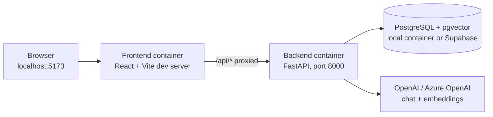
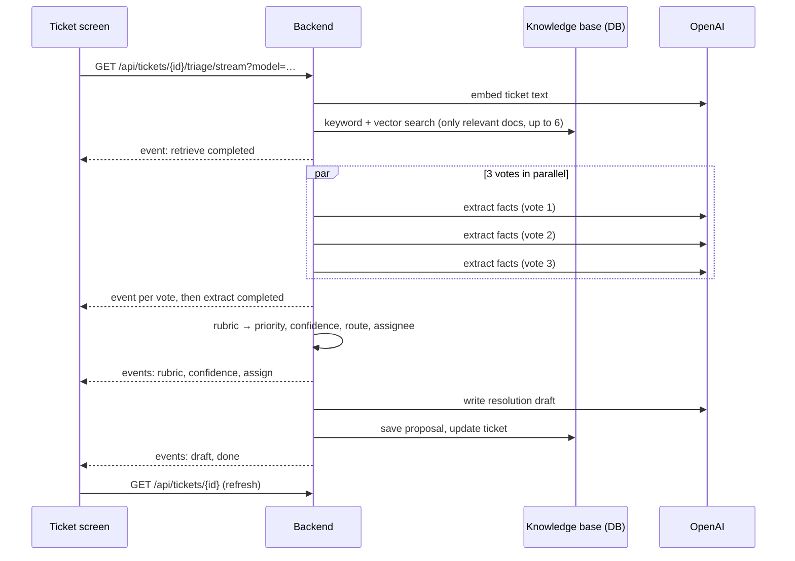

# 3 · Architecture

## The pieces



| Part | What it does | Where |
|---|---|---|
| **Frontend** | The screens analysts use. Talks only to `/api/*` | `frontend/` |
| **Backend** | API, triage pipeline, knowledge base, rules | `backend/` |
| **Database** | Tickets, proposals, reviews, knowledge documents (with embeddings), users | Docker volume, or Supabase |
| **LLM provider** | Reads tickets (structured output) and writes drafts; creates embeddings | OpenAI by default |

`docker-compose.yml` defines three services: `backend`, `frontend`, and `db` (the local
database, only started with `--profile local-db`, which `make up-local` does). Source folders
are mounted into the containers, so code changes reload automatically.

## One design rule behind everything

> **The LLM reads and judges. Plain code decides anything that can be looked up or computed.**

| Decided by the LLM | Decided by code |
|---|---|
| Work type, true service, the five facts, resolution status, which past solution matches, the draft text | Team (lookup from service), Impact and Urgency (rubric), Priority (matrix), priority score, confidence, route, SLA, assignee |

Why: the code parts are exact, testable, and can't break the rules (e.g. priority always
matches the matrix). The LLM only does what needs reading comprehension.

## How a triage request travels



The same pipeline also runs without streaming (`POST /api/tickets/{id}/triage`, batch triage).
See [Triage pipeline](04-Triage-Pipeline.md).

## Folder map

```
backend/
  app/
    main.py            FastAPI app; all routes under /api
    config.py          every setting (from .env)
    domain.py          fixed facts: services, teams, criticality, the priority matrix
    schemas.py         the API contract (request/response models)
    models.py          database tables
    ingest.py          Jira record / email → ticket; ticket → text for the AI
    chat.py            messaging helpers (channels, posting)
    api/               routes: tickets, triage, knowledge (+ Copilot), insights (+ Impact), people, chat, system
    pipeline/
      pipeline.py      runs the steps in order, yields live events
      retrieve.py      hybrid search (keywords + embeddings)
      classify.py      the LLM extraction with 3 votes
      rubric.py        facts → impact, urgency, priority, 0–1 score
      confidence.py    confidence, routing, SLA
      assignment.py    expert vs recommended assignee, workload
      draft.py         resolution comment
      rules.py         team lookup, expert from matched document
      llm.py           OpenAI / Azure / Apertus client, model choice
    kb/
      services.yaml    20 service cards (edit freely)
      playbook.jsonl   21 resolution notes (generated from training data)
      roster.yaml      people, teams, roles, capacity (generated, edit freely)
      sync.py          loads the files above into the database
      learn.py         done tickets → new knowledge (learning loop)
    scripts/           import tickets, build playbook/roster, sync, export contract, seed_demo
  alembic/versions/    database migrations
  migrations_sql/      the same migrations as plain SQL (for the Supabase SQL editor)
  tests/               pytest
frontend/src/
  api/                 generated types, typed client, hooks, live stream reader
  components/          layout, UI primitives, triage widgets, walkthrough, charts, persona switcher, compose dialog
  copilot/             the Copilot chat panel and its state
  pages/               one file per screen
  viewas/, model/      "View as" and model-picker state
contracts/openapi.json the API contract (generated)
data/                  training data + teammates' data scripts; data/raw/ is git-ignored
docs/wiki/             this wiki
```

## The contract between frontend and backend

The backend's Pydantic models are the single source of truth for every request and response.

```
backend/app/schemas.py ──make contract──▶ contracts/openapi.json ──▶ frontend/src/api/schema.d.ts
```

The frontend never hand-writes API types. Change the backend API, run `make contract`, and
TypeScript shows every place in the frontend that needs updating. CI fails if the generated
files are stale. More in [Development workflow](12-Development-Workflow.md).
