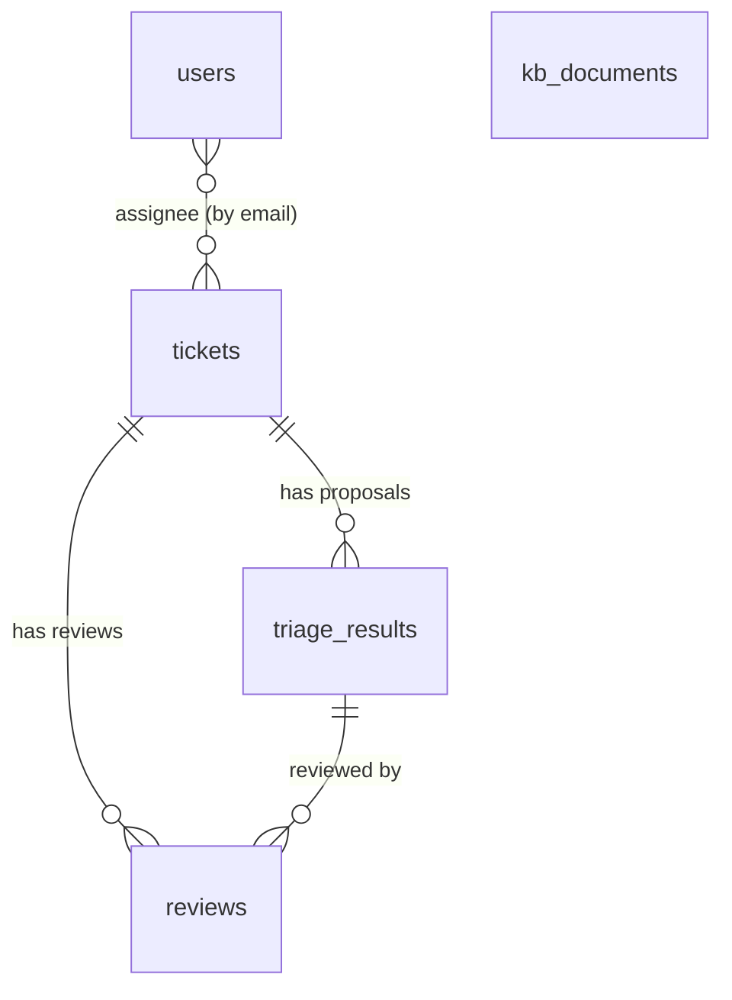

# 8 · Data and database

## The dataset: facts every design choice relies on

| Fact | Consequence |
|---|---|
| 20,000 training tickets collapse to **173 distinct texts** (11 templates × services), and every title contains its service name | A classifier trained on it just learns "read the service from the title"; challenge titles don't work like that. We use an LLM |
| **Priority, Urgency, Impact are random** in training | Defined by rules, not learned ([priority](05-Priority-and-Confidence.md)) |
| **Resolution status and the Assignee column are random** | Not learned from those columns |
| **Service → Team is fixed** (20 services → 11 teams, 100% consistent) | Team is a lookup (`domain.py`) |
| Only **21 real resolution notes**, each always by the same author | They form the playbook and identify the expert |
| 27% of tickets sit in **"Emailed Support Tickets"**, a generic bucket | Almost never the right final service; flagged as low confidence |
| All 20 challenge tickets already match the matrix for their **submitted** urgency/impact | Points come from **re-assessing** urgency/impact from the text |
| The challenge adds **Request type** and **Linked issues** | Passed to the LLM as hints |

Files:

| File | In git? | What |
|---|---|---|
| `data/jira_first_20000_requested_fields_synthetic.json` | yes | Training set |
| `data/raw/jira_hackathon_blind_eval_challenge_*.json` | **no**, copy it in | The 20 challenge tickets |
| `data/main.py`, `data/rules.md`, … | yes | Teammates' data-processing work (independent of the app) |

## Tables



### `tickets`: a ticket as it arrived, plus queue fields

| Column | Meaning |
|---|---|
| `id` (uuid), `number` | Internal id, human-friendly number (#21) |
| `source` | challenge · training · manual · email |
| `work_type`, `request_type`, `summary`, `description`, `affected_service`, `business_entity`, `reporter`, `urgency`, `impact`, `priority`, `status`, `linked_issues`, `comments` | **Intake values**, as received (may be wrong) |
| `raw` | The original Jira record (used by the export). `raw.manual` holds staff-confirmed fields |
| `triage_state` | new → proposed → approved / edited / rejected |
| `assignee` | Working assignee (workload-aware) |
| `ai_service`, `ai_team`, `ai_priority`, `priority_score`, `confidence`, `route`, `escalated`, `sla_due_at` | Copied from the latest proposal (updated by reviews) so the queue can sort and filter fast |

### `triage_results`: one AI proposal (re-running adds a new row)

| Column | Meaning |
|---|---|
| `work_type`, `service`, `team`, `assignee` (expert), `urgency`, `impact`, `priority`, `resolution`, `resolution_comment` | The decision (the seven challenge outputs, plus urgency/impact) |
| `facts`, `rubric_trace`, `priority_score` | What the rubric used and why |
| `vote_agreement`, `confidence`, `confidence_detail`, `route`, `escalated`, `sla_due_at` | Certainty and routing |
| `assignee_suggestion` | Expert, recommended, reason, all candidates with scores |
| `evidence`, `playbook_ref`, `rationale` | Retrieved documents, the matched one, the AI's explanation |
| `changed_fields`, `model`, `latency_ms` | What differs from intake, which model, how long |

### `reviews`: an analyst decision

`action` (approve / edit / reject), `final` (the decision after edits), `overridden_fields`,
`reviewer`, `notes`, `review_seconds`.

### `kb_documents`: the knowledge base

`kind`, `ref_id` (unique), `title`, `content`, `meta` (JSON), `embedding` (vector 1536). See
[Knowledge base](07-Knowledge-Base-and-RAG.md).

### `users`: the roster

`email` (primary key), `name`, `role` (analyst / lead / admin), `teams` (list), `capacity`.

### `messages`: team channels and direct messages

`channel` (`team:<Team>` or `dm:<email>|<email>`), `sender`, `body`, `kind` (message · handoff ·
escalation · system), `ticket_id` (optional), `created_at`. See [Collaboration](13-Collaboration-and-Copilot.md#messages).

### Simulated demo data

`make seed-demo` adds tickets with `source = "demo"` (plus their proposals, reviews and demo
messages); `make clear-demo` removes exactly those. See [Impact and demo data](14-Impact-and-Demo-Data.md).

## Migrations

The schema is managed with **Alembic** (`backend/alembic/versions/`). Each migration has a plain-SQL
twin in `backend/migrations_sql/` for pasting into the Supabase SQL editor.

| Revision | What it adds |
|---|---|
| `0001` | tickets, triage_results, reviews, kb_documents; enables `pgvector` |
| `0002` | users table; queue columns on tickets; facts/confidence/routing/assignment columns on triage_results |
| `0003_messaging` | messages table |

**The backend runs `alembic upgrade head` on every start.** On the shared Supabase, the first
teammate who starts a newer version migrates it for everyone.

### Two migration histories can share one database

Our migrations record their version in **`alembic_version_triage`**, not the default
`alembic_version`. The shared Supabase also has a teammate's own Alembic history
(`alembic_version` = `0003`, from Manan's branch, with extra ticket columns such as
`service_team`, `assignee`, `resolution_status`). Because the two histories use different
tables, **both apps can run against the same Supabase**.

How it works (`backend/alembic/env.py`):
- On the first run against a database without `alembic_version_triage`, the backend **adopts** it:
  if `alembic_version` holds one of our revisions (older local databases), it continues from
  there; if our base tables exist but the revision is someone else's, it starts from `0001`; an
  empty database gets everything created.
- Our migrations are **idempotent** (`IF NOT EXISTS`), so a column that already exists, like his
  `tickets.assignee`, is simply skipped.

### Current state of the shared Supabase (25 Sep 2026)

| Table | Value | Owner |
|---|---|---|
| `alembic_version` | `0003` | Manan's branch (untouched) |
| `alembic_version_triage` | `0003_messaging` | this branch |

Files kept for safety:

| File | What |
|---|---|
| `migrations_sql/supabase_snapshot_before_triage_copilot.sql` | The exact schema before our migrations (Manan's state) |
| `migrations_sql/rollback_triage_copilot.sql` | Removes only our additions; his tables, columns, data and version stay. Tested |

Check the state any time in the Supabase SQL editor:

```sql
select 'ours' as history, version_num from alembic_version_triage
union all select 'teammate', version_num from alembic_version;
```

### Rules for the shared database

1. **A migration is only applied to Supabase after its file is pushed to git.**
2. **One person writes migrations at a time**, so revision ids don't collide.
3. **Keep migrations additive and idempotent** (new tables, nullable or defaulted columns,
   `if_not_exists=True`), so teammates on older code keep working.

### Creating a migration

```bash
# 1. edit backend/app/models.py
# 2. generate it (against your LOCAL database, with the stack running via make up-local)
DATABASE_URL=postgresql+psycopg://postgres:postgres@db:5432/triage make migration m="add x"
# 3. review the generated file; add if_not_exists=True to add_column / create_table / create_index
# 4. make the SQL twin for Supabase
docker compose run --rm --no-deps backend alembic upgrade 0003_messaging:<new_rev> --sql > backend/migrations_sql/<new_rev>.sql
# 5. commit both, push, tell the team
```

CI checks that `models.py` and the migrations match (`alembic check`).

### Applying to Supabase

Start the app against Supabase (`docker compose up --build`, or `make up`); it applies pending
migrations automatically. Or paste the SQL files into the Supabase SQL editor in order.
