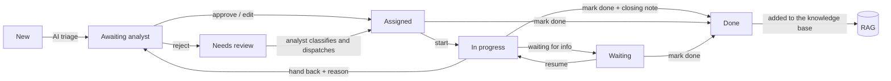

# 15 · Roles and the ticket lifecycle

Who does what, and which steps a ticket goes through from arrival to done. Every other page
follows this one.

## Three roles

| Role | Who (roster) | Job | Sees |
|---|---|---|---|
| **Team Lead / Analyst** (`analyst`) | One per department, 11 in total | **Checks and dispatches.** Reviews the AI's proposal for every ticket in their department, approves, edits or rejects it, and picks the specialist. Handles escalations and workload | Triage inbox, Needs review, My department, Escalations, All · New ticket, Team workload, Impact |
| **Specialist** (`specialist`) | The other department members, 23 in total | **Does the work.** Starts the ticket, asks for missing information if needed, and marks it done with a closing note | My work, My department, Escalations, All |
| **Admin** (`admin`) | One (Desk Admin) | **Runs the system**: knowledge base, import/export, settings, roster. Can act on any ticket, which is handy for demos | Everything, across all departments |

The challenge is about the **service-desk analyst**, the person who triages. The AI does that
person's first pass. The analyst stays in charge, and specialists never get work the analyst
hasn't approved.

**Every department has exactly one Team Lead / Analyst** and at least one specialist (the roster
builder guarantees it, and a test checks `roster.yaml`). If a department ever loses its lead, the
admin covers it: the admin's Triage inbox shows every department, and "ticket done" notices go to
the admin instead.

There's no login. Use the **View as** switcher (top right) to act as anyone. Its three demo picks
are the admin, the analyst with the busiest department, and the busiest specialist.

## The lifecycle

| Status (`work_status`) | Shown as | Who acts next | Actions |
|---|---|---|---|
| `open`, not triaged | *not triaged* | any analyst (Needs review) | run the AI triage |
| `open`, route `auto`/`review` | *awaiting analyst* | the department's analyst (Triage inbox) | **Approve & dispatch**, **Edit** (then dispatch), **Reject** |
| `open`, handed back | *handed back* | the department's analyst (Triage inbox) | **Approve & dispatch** (skips whoever handed it back), or dispatch someone from the list |
| `open`, route `triage` or rejected | *needs review* | any analyst (Needs review) | edit the service and dispatch, or dispatch directly from the candidate list |
| `assigned` | *assigned* | the specialist | **Start work**, **Waiting for info**, **Mark done**, **Hand back** |
| `in_progress` | *in progress* | the specialist | **Mark done**, **Waiting for info**, **Hand back** |
| `waiting` | *waiting for info* | the specialist, once the reporter answers | **Resume**, **Mark done**, **Hand back** |
| `done` | *done* | nobody | none: it's in the knowledge base |

### Creating tickets

Analysts and the admin can create tickets (**New ticket**). Tickets also arrive by Jira import and
email. If the creator already picks the specialist in the form, that's their dispatch decision:
the ticket starts as `assigned` and skips the Triage inbox. The AI still triages it and keeps
every value the creator set.

### Every ticket goes through an analyst

Confidence never skips the analyst. It only changes how much attention the proposal needs:

| Confidence | Route | Label | Where it waits |
|---|---|---|---|
| ≥ 80% | `auto` | *high confidence* | Department's Triage inbox: usually one click to accept |
| 50–80% | `review` | *check carefully* | Department's Triage inbox |
| < 50% | `triage` | *low confidence* | Shared **Needs review** pool, because even the department may be wrong |

The AI **suggests** a specialist, the expert balanced by workload (see
[Assignment and workload](06-Assignment-and-Workload.md)). The ticket is only assigned when the
analyst approves. If the analyst moves the ticket to another department, the suggestion is
recomputed for that team.

### Done means done

When a specialist marks a ticket done, they choose the resolution type (done, clarification,
cannot reproduce, cancelled) and write the **closing note**. It is prefilled with the AI's suggested
resolution, and they change it to what they actually did. Then:

- the ticket leaves every open queue and stops counting towards their workload;
- the department's **Team Lead / Analyst is notified**: a direct message from the specialist
  ("Done: #N … (resolution). closing note") with a link to the ticket appears in their Messages;
- it's **added to the knowledge base** as a learned ticket, with the specialist's own note and the
  specialist as its resolver (see [Knowledge base and RAG](07-Knowledge-Base-and-RAG.md#the-learning-loop));
- the specialist gains expertise on that service, which future assignments use;
- the challenge export uses the specialist's resolution and note instead of the AI's draft.

There's no separate verification step: the specialist who did the work closes the ticket.

### Activity timeline

Every step is logged on the ticket (`tickets.activity`): AI triaged it, the analyst approved and
dispatched it, the specialist started, waited (with the reason), resumed and marked it done. The
ticket screen shows this as the **Activity** card.

## Who may do what

There's no login, so every state-changing call names the person acting (`by`, `reviewer`,
`created_by` or `sender`). The backend checks that person's role against the ticket, and the UI
only shows the buttons they can use.

| Action | Specialist | Team Lead / Analyst | Admin |
|---|---|---|---|
| Create a ticket (New ticket) | – | ✓ | ✓ |
| Approve / edit / reject the AI proposal | – | own department + Needs review | ✓ |
| Dispatch or reassign | – | own department + Needs review | ✓ |
| Start, wait, resume, mark done | only their own tickets | – | ✓ |
| Hand back | only their own tickets | – | ✓ |
| Escalate | their own tickets | own department | ✓ |
| De-escalate | – | own department | ✓ |
| Delete a ticket | – | – | ✓ |
| Team workload, Impact | – | ✓ | ✓ |
| Knowledge base, Intake & export, Settings | – | – | ✓ |

Pages a role can't use are hidden in the sidebar **and** blocked if opened by URL. Jira import and
email are the automatic intake channels (admin screen), separate from people creating tickets.

## Escalations and hand-backs

**Escalate** raises attention one level up (specialist → their Team Lead / Analyst → the Admin)
and keeps the assignee. **Hand back** returns the ticket to the analyst to reassign, and the next
suggestion skips whoever handed it back. **De-escalate** ends an escalation. Details:
[Collaboration and Copilot](13-Collaboration-and-Copilot.md#escalate-hand-back-ask-three-different-things).

## Rules the backend enforces

- Only the assigned specialist (or an admin) can move the work along: `POST /api/tickets/{id}/work`.
- Only the department's analyst (any analyst for Needs review) or an admin can decide, dispatch,
  reassign or de-escalate (`403` otherwise). A decision is only possible while the ticket is
  waiting for an analyst (`409` once dispatched: reassign instead).
- Work only goes to **specialists of the ticket's department** (`400` otherwise: change the
  service first to move it to another department).
- A hand-back needs a reason (`422`).
- Transitions must be valid. You can't start a ticket that isn't assigned, resume one that isn't
  waiting, or change a done ticket (`409`).
- Marking done needs a resolution and a non-empty closing note (`422`).
- Only specialists are suggested or counted as assignees; analysts dispatch but don't hold tickets.
- Re-running the AI triage on a ticket already with a specialist keeps its assignee and status.
