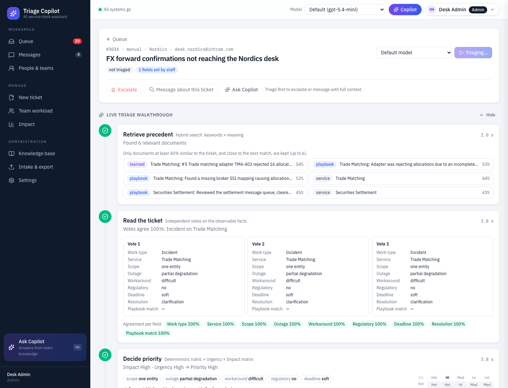

# 16 · Screen tour

Every screen, in the order a ticket meets them. The screenshots come from a local run with the
simulated demo history (`make seed-demo`), so the numbers are illustrative.

## Queue

The home screen. Tabs depend on the role:

- **Team Lead / Analyst:** *Triage inbox* (AI proposals for their department), *Needs review*
  (untriaged, low-confidence or rejected tickets, shared by all analysts), *My department*,
  *Escalations*, *All tickets*.
- **Specialist:** *My work*, *My department*, *Escalations*, *All tickets*.
- **Admin:** the inbox for every department, plus *Needs review*, *Escalations*, *All tickets*.

Rows are ranked by the 0–1 priority score, then by SLA. Each shows the priority (with the score
bar), the SLA countdown, the service (violet `old → new` when the AI corrected the intake), the
specialist, the confidence, and a status pill (*not triaged*, *needs review*, *awaiting analyst* with
its confidence label, *handed back*, *assigned*, *in progress*, *waiting for info*, *done*).
Untriaged rows have **▶ Triage**. Done tickets are hidden unless **Show done** is ticked.

## Live triage walkthrough

**▶ Triage**, *Watch the AI triage it* or *Re-run live* stream each stage from the server:

1. **Retrieve precedent:** only documents at least 40% similar (and close to the best hit), each
   with its similarity. With nothing similar it says so: a new kind of problem.
2. **Read the ticket:** the three independent AI readings side by side; cells that differ from the
   majority are highlighted, with the agreement per field underneath.
3. **Decide priority:** the facts, the rule sentences, the highlighted matrix cell and the score.
4. **Measure confidence:** the two measured parts, the flags, the route.
5. **Suggest a specialist:** the expert, the candidates with their load, who the ticket waits for.
6. **Draft the resolution:** from the matched past fix, or first steps when there is none.

## Ticket

- **Header:** priority, SLA, status and specialist; *Escalate* / *De-escalate*, *Message about this
  ticket*, *Ask Copilot*; *Re-run live* for people who manage the ticket.
- **As received:** the original ticket, including the intake values (often wrong on purpose).
- **Proposal:** every field tagged **AI reads**, **Rule** or **Lookup** with an (i) that explains
  the calculation (open above for *Service*). Violet shows a change from intake; amber shows vote
  disagreement or a staff value the blind AI reading or the rules disagree with.
- **Why this priority**, **Suggested resolution** (or *Suggested first steps*), **Confidence**,
  **Specialist** (suggestion, candidates, *dispatch* / *reassign*), **Evidence used**, **Activity**.

## The analyst's decision

| Before | After |
|---|---|
|  |  |

Only the department's Team Lead / Analyst (any analyst for Needs review) or the admin sees the bar:
**Approve & dispatch to …**, **Edit** (team and priority recomputed; then dispatch), **Reject**
(with a reason, to Needs review). Keyboard: A, E, R. The green confirmation offers **Next in inbox**.

## The specialist's work

| My work | Mark done |
|---|---|
|  |  |

The work bar: **Start work**, **Waiting for info…** (with what's missing), **Resume**,
**Hand back…** (with a reason: back to the analyst's inbox), **Mark done…** (resolution + closing
note, prefilled from the AI's draft only when it came from a real past fix).

## Messages

Department channels and direct messages. The analyst receives a green *ticket done* message for every
ticket their specialists finish; opening the ticket shows **Reopen…**. Also shown here: automatic
escalations (red cards), *handed back* and *reopened* notices, and messages carrying a ticket card.

## Copilot

Opens from the top bar, the sidebar or ⌘K, with the open ticket as context. Answers cite sources
(with similarity); a cited id that wasn't retrieved is struck through. Off-topic questions are
refused with nothing generated (bottom), and "not in the knowledge base" is said plainly.

## Escalate

*Escalate* (one level up: specialist → Team Lead / Analyst → Admin, or the department channel) or
*Ask a question*. **Draft with Copilot** writes the message with the ticket's context; sending an
escalation flags the ticket until it's de-escalated.

## New ticket

| Form | Rejected |
|---|---|
|  |  |

Analysts and the admin only. Required: summary, description, reporter. Optional fields say
**Automatic · AI reads it** / **rules compute it** / **rules suggest one**, each with its tag and (i).
Staff values are kept and cross-checked. Text that isn't a ticket is rejected with a reason.

## People, personas, workload

| People & teams | View as | Team workload |
|---|---|---|
|  |  |  |

The directory lists every department with its services, Team Lead / Analyst, specialists and their
load. **View as** switches persona (no login in the demo). **Team workload** (analysts, admin)
shows each specialist's open tickets against capacity, share, High/Highest tickets, oldest open
ticket and tickets done in the last 7 days.

## Impact

| KPIs and pain points | Trends |
|---|---|
|  |  |

Headline numbers, the **Desk KPIs** (time to assign, first-time accuracy with per-field accuracy,
AI misroutes, reassigned, reopened), eight pain-point cards with live numbers, then trends,
calibration and the most-corrected fields. The simulated history is labelled and can be switched
off. Definitions: [Impact and demo data](14-Impact-and-Demo-Data.md).

## Admin screens

| Knowledge base | Challenge set |
|---|---|
|  |  |

**Knowledge base:** test retrieval, browse service cards, the playbook and learned (done) tickets,
re-sync from the files. **Intake & export:** batch triage (proposals only), Jira import, email
intake, the challenge-set statistics (coverage and certainty, not accuracy) and the submission
export. **Settings:** thresholds, SLA targets, the matrix and the roster.

## On a phone

The sidebar becomes a scrolling tab bar, the queue table and its tabs scroll sideways, and the
ticket's decision and work bars stay pinned to the bottom of the screen.
